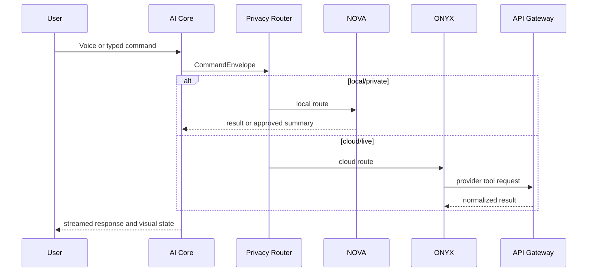

# Architecture

## Domains
1. AI Core: state machine, command envelope, mode switching and tool execution events.
2. ONYX Cloud Intelligence: finance, business analytics, news, Microsoft Graph, social intelligence and Home Assistant.
3. NOVA Local Intelligence: file search, document interpretation, screenshots, local telemetry and offline memory.
4. Memory Service: classified local, shared and cloud-approved memories with retention.
5. API Gateway: authentication, authorization, policy, rate limits and secret isolation.
6. Plugin System: manifests, requested scopes, tools, health and dashboard modules.
7. Automation Engine: schedule, event, voice and manual workflows.

## Privacy boundary
Raw local files, screenshots and local telemetry stay with NOVA. ONYX receives only explicit user-approved summaries. Live cloud data is routed through ONYX and server-side provider adapters. Secrets never enter assistant transcripts or frontend bundles.

## Communication sequence

